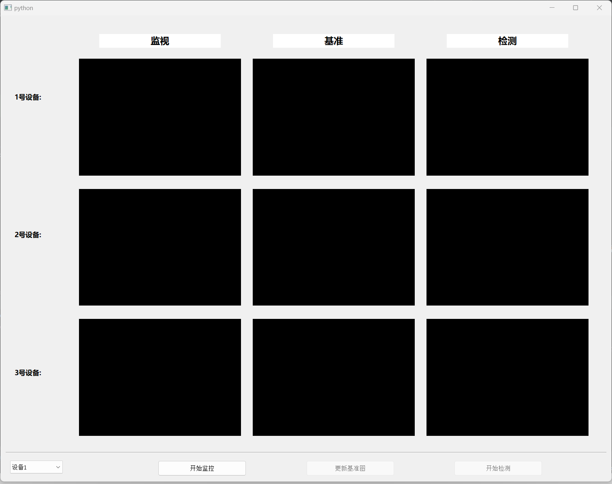

# GridMonitor

国家电网项目，演示终端

## 环境搭建

```shell
conda env create -f pyqt.yaml
conda activate pyqt
```

## 框架介绍
主要基于 PYQT

代码主体分为控件部分和展示部分，组件之间的通信采用 PYSIGNAL 的方式。

展示部分的结构，类似于表单，表头是功能说明，以下每一行抽象成一个 Device 对象，分为视频流监视、基准图展示、检测结果展示。

视频流通过 QThread 对象新建线程运行，利用 cond 原语控制视频流的播放暂停。

基准图和检测结果，基于回调展示结果。

## 效果图
